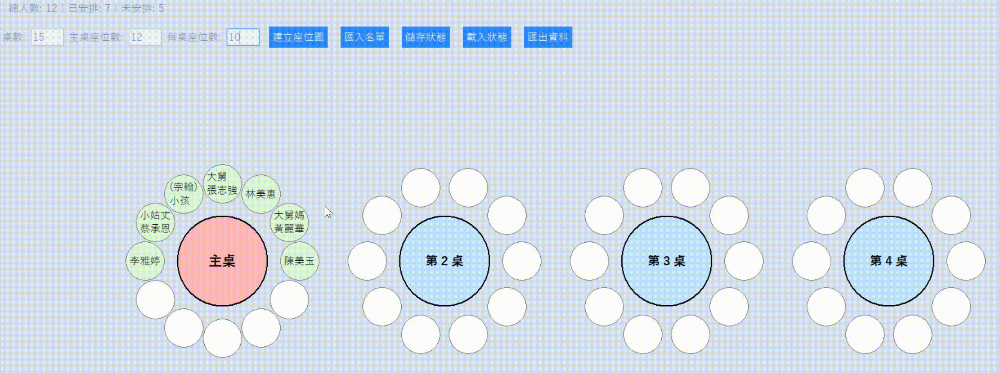

# Seat Arrangement App

[中文版本](./README_zh-TW.md)

A **drag-and-drop seating planner** built with Tkinter + ttkbootstrap.  
Designed for **banquets**, **weddings**, **conferences**, and other events where circular table seating arrangements are needed.



---

## Features
1. Drag-and-drop seat assignment
2. Seat-to-seat swap (swap directly by dragging between seats)
3. Right-click to cancel seat assignment
4. Customizable **main table seat count** (first table can have unique seat size)
5. Import guest list (TXT/CSV, ignores empty lines and lines starting with `#`)
6. Save / Load seating state (JSON format)
7. Export results to CSV / JSON
8. Real-time statistics: total / assigned / unassigned people
9. Up to 15 tables supported

---

## Development Environment
- Python 3.9+
- Tkinter (standard library)
- ttkbootstrap 1.10+

---

## Installation / Usage Example

1. **Prerequisites**
   - Install **Python 3.9+**  
   - Ensure Tkinter is available (usually included with Python)  
   - Install required packages  
   ```bash
   pip install -r requirements.txt
   ```

2. **Run**
   ```bash
   python seat_app.py
   ```

3. **Usage**
   - Enter number of tables / seats per table / (main table seats)  
   - Import or add people → drag them to seats  
   - Drag between seats to swap; right-click to cancel assignment  
   - Save / load state (JSON) or export results (CSV/JSON)

---

## Project Structure
```
─── seat-arrangement-app
   ├── README.md
   ├── README_zh-TW.md
   ├── LICENSE
   ├── .gitattributes
   ├── .gitignore
   ├── requirements.txt
   ├── sample_names.txt   # Sample List
   ├── seat_app.py        # Main
   └── demo/
       └── demo.gif
```

---

## Credits & Acknowledgments
- [ttkbootstrap](https://github.com/israel-dryer/ttkbootstrap)  
- [Python Tkinter](https://docs.python.org/3/library/tkinter.html)  
- All trademarks and copyrights belong to their respective owners.
